# Julie

<p align="center">
  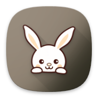
</p>

<p align="center">
  <strong>A privacy-focused, offline-first pet health tracker for Android.</strong>
</p>

<p align="center">
  
  
  
  
  
  
</p>

<p align="center">
  <a href="https://github.com/kaixenberg/Julie/releases/latest">
    
  </a>
</p>

---

## Why Julie Exists

Julie was created in loving memory of a pet rabbit named Julie. When caring for a pet with special medical or daily health routines, having a dependable, distraction-free tracker makes all the difference. This application was built to provide pet owners with complete peace of mind through a private, offline, and beautifully crafted daily health companion.

---

## Screenshots

### Onboarding & Setup
| Welcome | Add Pet | Pet Welcome Card |
| :---: | :---: | :---: |
| 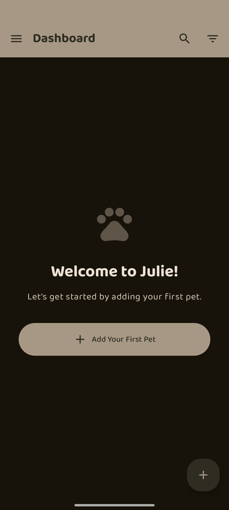 | 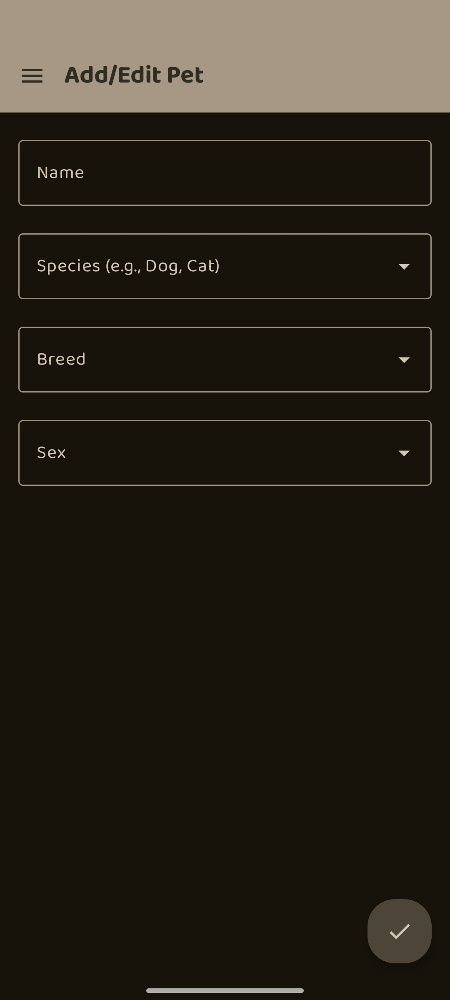 | 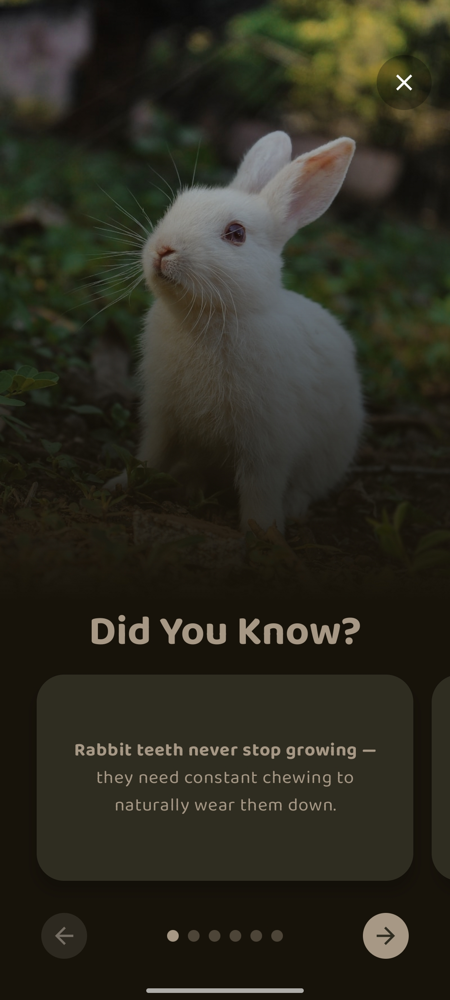 |

### Core Tracking & Health Insights
| Pet Stats Dashboard | Health Timeline | Weight Tracker |
| :---: | :---: | :---: |
| 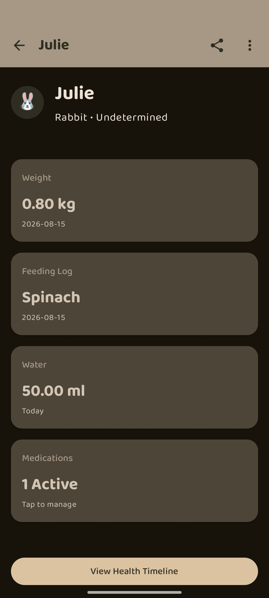 | 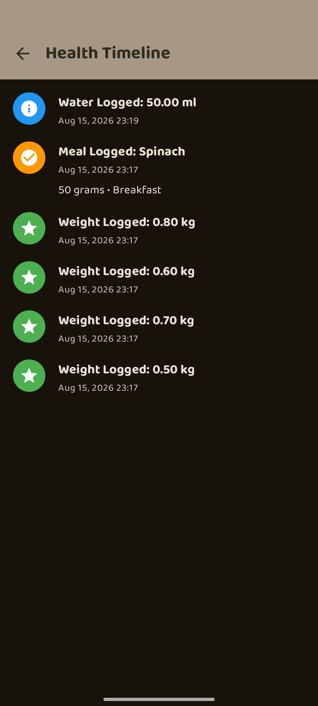 | 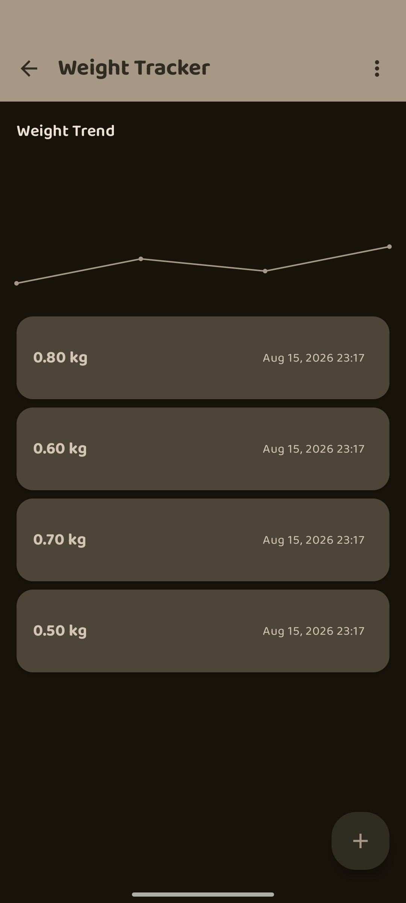 |

| Water Tracker | Feeding Log | Medications |
| :---: | :---: | :---: |
| 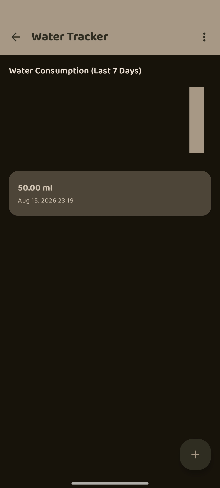 |  | 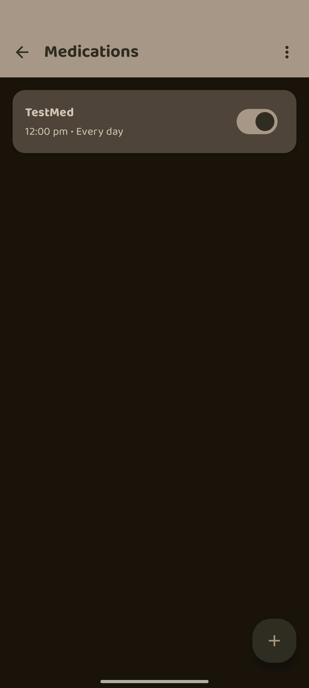 |

### Customization & Home Screen Widgets
| Settings & Theming | Home Screen Widgets |
| :---: | :---: |
| 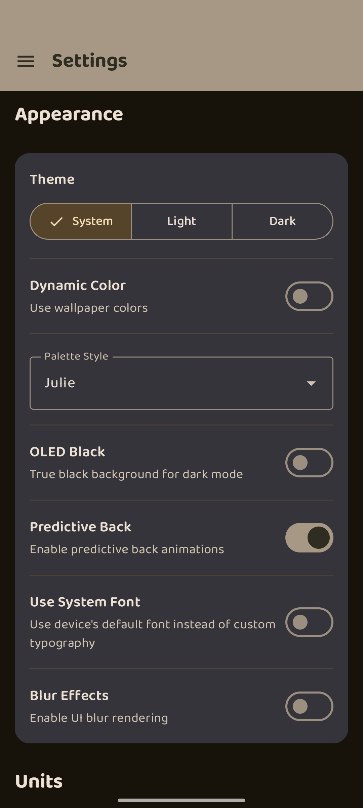 | 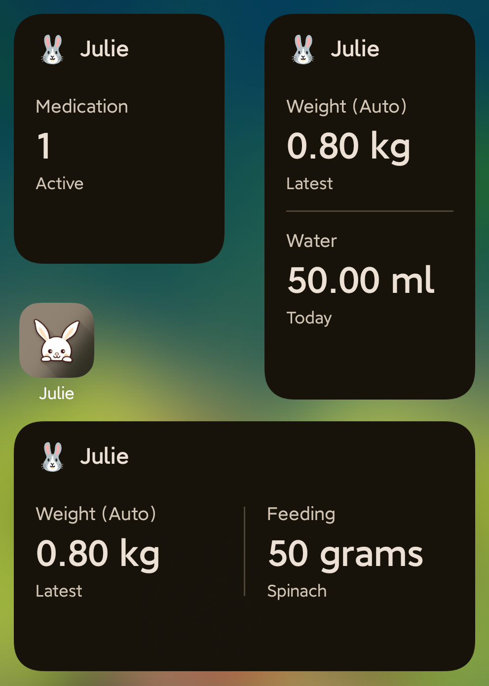 |

---

## Features

- **Multi-Pet Management**: Manage profiles for dogs, cats, rabbits, guinea pigs, mice, birds, and more with species-tailored fun facts, avatars, and quick-switching.
- **Dedicated Stat Trackers**:
  - **Weight Tracker**: Monitor weight trends with interactive chart visualizations and configurable units (`kg`, `g`, `lbs`, `oz`).
  - **Water Tracker**: Track daily hydration against customizable targets with automatic midnight resets and unit preferences (`ml`, `fl oz`).
  - **Feeding Log**: Log meal schedules, portion sizes, notes, and diet routines.
  - **Medication Management**: Schedule active medications, dosage quantities, frequencies, and track administration history.
- **Unified Health Timeline**: An integrated, chronological activity stream compiling feeding, medication, weight, and hydration logs into one continuous history.
- **Smart Local Reminders**: `AlarmManager`-backed precise alarms with configurable intervals (daily/hourly), custom quiet hours, and intelligent notification suppression.
- **Home Screen Widgets**: Material 3 Glance & RemoteViews widgets (2x2 and 4x2 layouts) providing glanceable summaries synchronized with app themes.
- **Encrypted & Automated Backups**: Secure, password-protected encrypted exports alongside automated background backups using Android's Storage Access Framework (SAF).
- **Offline PDF Health Reports**: Export clean, structured PDF summaries for veterinary visits generated entirely on-device.
- **Material 3 Expressive Theming**:
  - Full Dynamic Color (Monet) support for Android 12+.
  - Curated palettes (Julie Emerald, Bunny Brown, Sakura, Sky Blue, Lavender, Sunset).
  - True OLED AMOLED Black mode, customizable typography, and subtle UI blur styling (with low-overhead fallbacks for `armv7` builds).

---

## Tech Stack

- **Language**: Kotlin 2.x
- **UI Framework**: Jetpack Compose & Material 3 Expressive
- **Architecture**: Modern Android Architecture (MVVM, Clean Architecture, Repository Pattern, Kotlin Coroutines & Flow)
- **Dependency Injection**: Dagger Hilt
- **Local Persistence**: Room SQLite Database & Jetpack DataStore (Preferences)
- **Background Tasks & Alarms**: Exact `AlarmManager` & `WorkManager`
- **Widgets**: Android AppWidgets (`RemoteViews`) with dynamic system theme syncing
- **Document Processing**: Android Native Canvas PDF Generator

---

## Getting Started

### Prerequisites
- **Android Studio**: Ladybug (2024.2.1+) or newer
- **JDK**: Version 17
- **Android Device / Emulator**: Running Android 8.0 (API Level 26) or higher

### Building from Source

1. Clone the repository:
   ```bash
   git clone https://github.com/kaixenberg/Julie.git
   cd Julie
   ```

2. Assemble the debug APK:
   ```bash
   ./gradlew assembleDebug
   ```

3. Build optimized release APKs (produces `arm64-v8a`, `armeabi-v7a`, and `universal` binaries):
   ```bash
   ./gradlew release
   ```

---

## Project Structure

```text
app/src/main/java/our/bunny/julie/
├── data/        # Room entities, DAOs, database converters, and migrations
├── di/          # Dagger Hilt dependency injection modules
├── domain/      # Domain models, business logic rules, and repository contracts
├── manager/     # Coordinators for Alarms, Reminders, Backups, and Updates
├── receiver/    # BroadcastReceivers for exact alarms, device boots, and widget sync
├── ui/          # Jetpack Compose UI (Screens, Navigation, Theming, and Components)
├── util/        # Helpers for PDF generation, battery optimizations, units, and dates
├── widget/      # Home screen widget providers and remote layout configurations
└── workers/     # WorkManager tasks for scheduled background operations
```

---

## Privacy & Offline Guarantee

Julie is designed around zero compromise on privacy:
- **100% On-Device**: All pet data, photos, weight logs, and medical records stay on your physical device in local Room storage.
- **Zero Analytics & Tracking**: No tracking libraries, telemetry services, or advertising SDKs are included.
- **No Internet Required for Core Functionality**: Backups and PDF exports are created locally through Android's Storage Access Framework (SAF).

---

## License

License: TBD

---

## Credits & Dedication

- **Created by**: Smarajit ([@kaixenberg](https://github.com/kaixenberg))
- **Special Thanks**: Shramana (Project Inspiration & Support)
- **In Memory of**: Julie
- **Animal Photography (Fun Facts)**: Provided by Unsplash artists Charles Deluvio (Dog), Manja Vitolic (Cat), Satyabratasm (Rabbit), David Clode (Bird), Bonnie Kittle (Guinea Pig), and Ricky Kharawala (Mouse).
